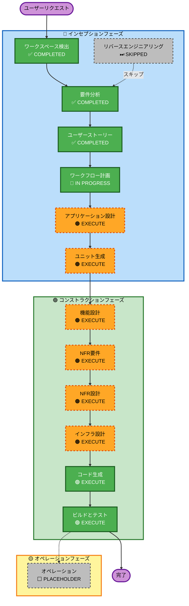

# 実行計画

## 詳細分析サマリー

### 変更影響評価
| 観点 | 有無 | 内容 |
|---|---|---|
| ユーザー向け変更 | あり | ECサイト全体（商品閲覧・購入・マイページ・管理画面） |
| 構造的変更 | あり | 新規システム構築（グリーンフィールド） |
| データモデル変更 | あり | 商品・注文・ユーザー・ライセンスキーなど新規スキーマ設計が必要 |
| API変更 | あり | 決済API（Stripe）・メール送信API（SES/Resend）との連携 |
| NFR影響 | あり | セキュリティ（PCI DSS準拠・OWASP対策）・パフォーマンス（3秒以内） |

### リスク評価
| 項目 | 評価 | 低減策 |
|---|---|---|
| リスクレベル | **低**（対策済み） | 実績ある既製品を組み合わせる設計を採用：Stripe（決済）・NextAuth.js（認証）・Vercel（ホスティング）。独自実装を最小化することで設計ミスのリスクを排除 |
| ロールバック難度 | 低 | グリーンフィールドのため既存システムへの影響なし |
| テスト複雑度 | **低**（対策済み） | Stripe テストモード（偽カード番号）を使った自動テストをビルドフェーズで整備。決済→ダウンロードの一連フローをE2Eテストでカバー |

---

## ワークフロー可視化



### テキスト代替表現

```
インセプションフェーズ:
  - ワークスペース検出    : ✅ COMPLETED
  - リバースエンジニアリング: ⏭ SKIPPED（グリーンフィールドのため）
  - 要件分析            : ✅ COMPLETED
  - ユーザーストーリー    : ✅ COMPLETED
  - ワークフロー計画      : 🔄 IN PROGRESS
  - アプリケーション設計  : 🟠 EXECUTE
  - ユニット生成         : 🟠 EXECUTE

コンストラクションフェーズ（ユニットごとに繰り返し）:
  - 機能設計            : 🟠 EXECUTE
  - NFR要件             : 🟠 EXECUTE
  - NFR設計             : 🟠 EXECUTE
  - インフラ設計         : 🟠 EXECUTE
  - コード生成           : 🟢 EXECUTE（常時）
  - ビルドとテスト        : 🟢 EXECUTE（常時）

オペレーションフェーズ:
  - オペレーション        : ⬜ PLACEHOLDER
```

---

## 実行ステージ一覧

### 🔵 インセプションフェーズ
- [x] ワークスペース検出（COMPLETED）
- [x] リバースエンジニアリング（SKIPPED — グリーンフィールドのため）
- [x] 要件分析（COMPLETED）
- [x] ユーザーストーリー（COMPLETED）
- [x] ワークフロー計画（IN PROGRESS）
- [ ] アプリケーション設計 — **EXECUTE**
  - **理由**: 新規システムにつき、フロントエンド・バックエンド・管理画面・決済・配信サービスなどコンポーネント境界とサービス層の設計が必要
- [ ] ユニット生成 — **EXECUTE**
  - **理由**: 20ストーリー・5エピックを開発ユニットに分割し、並行開発の計画を立てるために必要

### 🟢 コンストラクションフェーズ（ユニットごと）
- [ ] 機能設計 — **EXECUTE**
  - **理由**: 新規データモデル（商品・注文・ユーザー・ライセンスキー）と決済フローのビジネスロジック設計が必要
- [ ] NFR要件 — **EXECUTE**
  - **理由**: セキュリティ（OWASP・PCI DSS）・パフォーマンス（3秒以内）要件の技術スタック選定が必要
- [ ] NFR設計 — **EXECUTE**
  - **理由**: NFR要件を設計パターンに落とし込む（署名付きURL・Stripeセキュリティ・認証フロー等）
- [ ] インフラ設計 — **EXECUTE**
  - **理由**: AWS S3 + CloudFront（署名付きURL）・RDS・SES・Vercel等のインフラマッピングが必要
- [ ] コード生成 — **EXECUTE**（常時）
- [ ] ビルドとテスト — **EXECUTE**（常時）

### 🟡 オペレーションフェーズ
- [ ] オペレーション — PLACEHOLDER（将来拡張）

---

## 成功基準
- **主目標**: UXに優れたシンプルなデジタル商品ECサイトの構築
- **主要成果物**: 動作するWebアプリケーション（フロントエンド・バックエンド・管理画面）
- **品質ゲート**:
  - 購入完了まで最大2ステップ
  - ページ読み込み3秒以内（Core Web Vitals）
  - OWASP Top 10対策済み
  - 全ユーザーストーリー（20件）の受け入れ基準をパス
